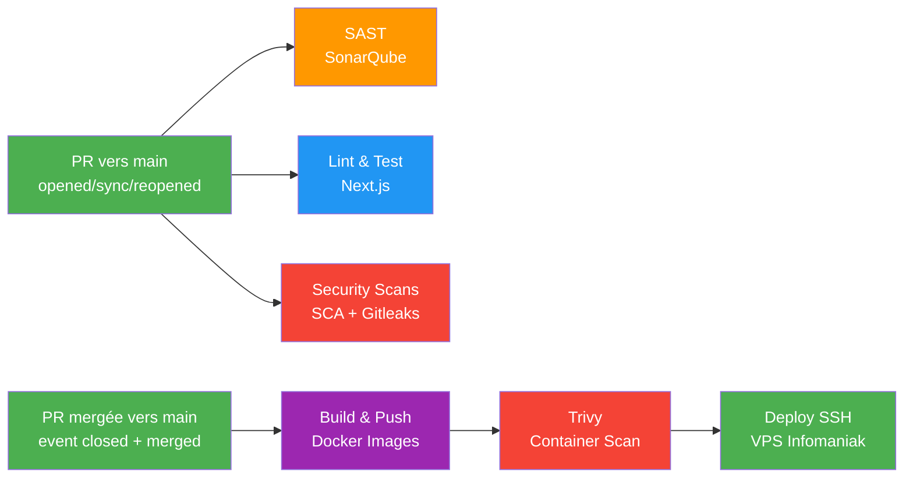

# Architecture du projet REF

## Vue d'ensemble

Application web full-stack composée d'un CMS headless (Strapi), d'un frontend React (Next.js), et d'une base de données PostgreSQL. L'ensemble est conteneurisé via Docker et déployé automatiquement sur un VPS Infomaniak via GitHub Actions.

## Schéma d'Infrastructure

```
┌──────────────────────────────────────────────────────────────────┐
│                        VPS Infomaniak                            │
│                                                                  │
│  ┌─────────────────┐                                             │
│  │  Nginx Proxy    │ ◄── HTTPS (Let's Encrypt)                   │
│  │  Manager        │                                             │
│  └────────┬────────┘                                             │
│           │                                                      │
│  ┌────────▼────────────────────────────────────────────────────┐  │
│  │              Docker Network (app-network)                   │  │
│  │                                                             │  │
│  │  ┌──────────────┐   ┌──────────────┐   ┌───────────────┐   │  │
│  │  │  Next.js 14   │   │  Strapi 5    │   │  PostgreSQL   │   │  │
│  │  │  (Frontend)   │──►│  (Backend)   │──►│  17-Alpine    │   │  │
│  │  │  :3000        │   │  :1337       │   │  :5432        │   │  │
│  │  └──────────────┘   └──────────────┘   └───────────────┘   │  │
│  │                                                             │  │
│  │  ┌──────────────┐             ┌────────────────────────┐    │  │
│  │  │  Prometheus   │────────────►│  Grafana Cloud         │    │  │
│  │  │  :9090        │               (Dashboard externe)   │    │  │
│  │  └──────────────┘             └────────────────────────┘    │  │
│  └─────────────────────────────────────────────────────────────┘  │
└──────────────────────────────────────────────────────────────────┘
```

## Pipeline CI/CD

Le pipeline est volontairement séparé en deux workflows pour garder des responsabilités claires :

- `main.yml` : **Pull Request Analysis** (qualité + sécurité sur PR vers `main`)
- `deploy-on-merge.yml` : **Build & Deploy** (uniquement quand la PR est mergée vers `main`, ou déclenchement manuel)



### Détail des jobs CI/CD

| Job | Outils | Rôle | Bloquant ? |
|-----|--------|------|------------|
| `analyze` | SonarQube | SAST — analyse statique du code (workflow PR) | Non (informatif) |
| `lint-and-test` | ESLint, Jest | Linting + Tests unitaires avec couverture | ✅ Oui |
| `security-scans` | npm audit, Gitleaks | SCA dépendances + détection de secrets (workflow PR) | ✅ Oui |
| `build-and-push` | Docker, Trivy | Build multi-stage + push GHCR + scan conteneur (post-merge) | ✅ Oui |
| `deploy` | SSH | Déploiement automatique sur VPS (post-merge) | Uniquement sur PR mergée vers `main` |

### Artefacts de pipeline (preuves techniques)

Pour conserver une traçabilité claire de chaque exécution, le pipeline produit les artefacts suivants :

| Artefact | Généré par | Contenu | Usage |
|----------|------------|---------|-------|
| `frontend-coverage` | `lint-and-test` | Rapport `lcov.info` du frontend | Qualité de tests + alimentation SonarQube |
| `npm-audit-reports` | `security-scans` | Rapports audit frontend/backend (`.txt`) | Preuve SCA et suivi des dépendances vulnérables |
| Résultat Gitleaks | `security-scans` | Sortie du step `Secret Detection - Gitleaks` | Validation qu'aucun secret n'est commité |

Ces artéfacts, au-delà du "pipeline vert", permettent de conserver les preuves vérifiables de qualité et de sécurité.

## Choix Technologiques


### Docker Compose de développement et de production
- `docker-compose.yml` : configuration pour le développement local (hot-reload, volumes)
- `docker-compose.prod.yml` : configuration optimisée pour la production (multi-stage build, pas de volumes, variables d'environnement sécurisées)

Création de deux configurations docker-compose permet de séparer clairement les environnements et d'éviter les erreurs de configuration lors du déploiement.

Association des services à un réseau Docker (`app-network`) pour une communication sécurisée entre les conteneurs sans exposer les ports en dehors du VPS.

### Dockerfile multi-stage build
La décomposition en plusieurs étapes permet d'optimiser la taille finale des images avec seulement les fichiers nécessaires à l'exécution. Cela permet également d'assurer la sécurité des images en incluant uniquement les dépendances de production et en utilisant un utilisateur non-root.

Le multi-stage build permet également de dissocier deux configurations différentes pour le développement (avec hot-reload, outils de debug) et la production (optimisée pour la performance et la sécurité).

### Monitoring avec Grafana et Prometheus
Implémentation d'uns stack de monitoring complète afin de surveiller la sant&é de l'application en production, détecter les anomalies, et assurer une maintenance proactive. Celle-ci est complètement optionnelle au démarrage du projet car les services de monitoring sont attribués à un profile Docker distinct (`monitoring`) et ne sont pas nécessaires pour le fonctionnement de l'application.

Cette stack de monitoring comporte :
- **Prometheus** : collecte des métriques (CPU, RAM, uptime, requêtes HTTP)
- **Grafana** : dashboard de visualisation (self-hosted)
- **Blackbox Exporter** : vérification de la disponibilité des endpoints
- **cAdvisor** : surveillance des ressources des containers

Grafana est géré en self-hosted sur le même VPS pour éviter les coûts liés à Grafana Cloud et pour avoir un contrôle total sur les données de monitoring. Les dashboards sont préconfigurés pour afficher les métriques essentielles de l'application.

### Reverse-proxy Nginx
Nginx Proxy Manager est utilisé pour gérer le reverse proxy et les certificats SSL. Il permet d'être le premier point d'entrée pour les requêtes HTTP/HTTPS, de rediriger vers les services backend et frontend, et de gérer facilement les certificats Let's Encrypt pour le HTTPS.

### Pipeline avec GitHub Actions
Le pipeline CI/CD est entièrement automatisé avec GitHub Actions permettant de profiter d'une cohérence entre le versionning du code et les étapes de build, test, et déploiement. L'utilisation de GitHub Actions permet également d'intégrer facilement des outils de qualité de code, de sécurité, et de monitoring dans le processus de développement comme SonarQube, Trivy, et Gitleaks.

### Qualite de code et régression avec SonarQube
SonarQube est intégré pour assurer une qualité de code constante et pour détecter les bugs, les vulnérabilités, et les régressions avant le déploiement en production. SonarQube fournit des rapports détaillés sur la qualité du code, la duplication de code mais également les régressions amenés par les nouveaux commits.

### Sécurité avec Trivy et Gitleaks
L'outil Trivy est utilisé pour scanner les images Docker à la recherche de vulnérabilités dans les dépendances. En cas de vulnérabilités critiques, le pipeline échoue pour éviter de déployer du code potentiellement dangereux en production. L'outil Trivy dispose également d'une base CVE régulièrement mise à jour pour garantir une détection efficace des vulnérabilités ainsi que d'une intégration facile avec GitHub Actions via `aquasecurity/trivy-action`.

Gitleaks est utilisé pour détecter les secrets (API keys, tokens) qui auraient pu être commit dans le code source. Ainsi on évite de fuiter des credentials sensibles dans le repository. Gitleaks scanne l'historique complet du repository pour détecter les secrets même s'ils ont été supprimés dans des commits ultérieurs.

### Snyk Sécurité des dépendances
Snyk est utilisé pour scanner les dépendances du projet à la recherche de vulnérabilités connues. Snyk fournit des rapports détaillés sur les vulnérabilités détectées ainsi que des recommandations pour les corriger (mise à jour de version, patch, etc.).

Le point fort de Snyk est qu'il créé automatiquement des pull requests comportant les mises à jour nécessaires pour corriger les vulnérabilités détectées dans les dépendances. Cela permet de maintenir les dépendances à jour et de réduire le risque de vulnérabilités dans le projet facilement.

## Problématiques rencontrés

### Récupération des métriques de monitoring
- Problème : Mon dashboard Grafana était vide malgré la configuration de Prometheus

**Solution** : Prometheus ne récupérait pas correctement les métriques des services car les formats des endpoints exposés n'étaient pas conformes à ce que Grafana attendait. J'ai dû ajouter deux autres services de monitoring (*Blackbox Exporter* et *cAdvisor*) pour collecter les métriques de disponibilité des endpoints et d'utilisation des ressources des containers. J'ai également dû ajuster la configuration de Prometheus pour qu'elle scrape correctement ces nouveaux endpoints.

- Problème : Uptime NextJS faussé indiquant "down" alors que le service était en ligne

**Solution** : J'ai réalisé que le problème venait du fait que Next.js n'expose pas de métriques de santé par défaut. J'ai donc ajouté un middleware personnalisé dans Next.js pour exposer un endpoint `/metrics` avec les métriques de santé et de disponibilité. Ensuite, j'ai configuré Prometheus pour scraper ce nouvel endpoint afin d'avoir des données précises sur l'uptime de Next.js.


## Structure du Projet

```
Ref/
├── .github/workflows/
│   ├── main.yml              # Pull Request Analysis (qualité + sécurité)
│   └── deploy-on-merge.yml   # Build images + déploiement post-merge
├── apps/
│   ├── api/                   # Strapi 5 (Backend CMS)
│   └── web/                   # Next.js 14 (Frontend React)
├── docker/
│   ├── backend/
│   │   ├── development/Dockerfile
│   │   └── production/Dockerfile    # Multi-stage build
│   ├── frontend/
│   │   ├── development/Dockerfile
│   │   └── production/Dockerfile    # Multi-stage build
│   ├── monitoring/
│   │   ├── prometheus.yml           # Config Prometheus
│   │   └── grafana/provisioning/    # Dashboards & datasources
│   └── nginx/                       # Config reverse proxy
├── docs/
│   ├── ARCHITECTURE.md              # Ce document
│   └── evidence/                    # Captures de validation
├── docker-compose.yml               # Développement local
├── docker-compose.prod.yml          # Production (VPS)
├── README.md                        # Documentation principale
└── MONITORING_GUIDE.md              # Guide monitoring détaillé
```
