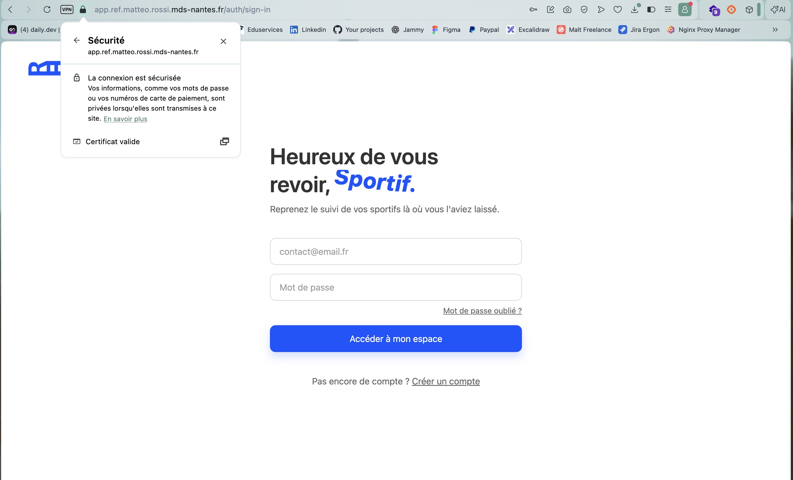
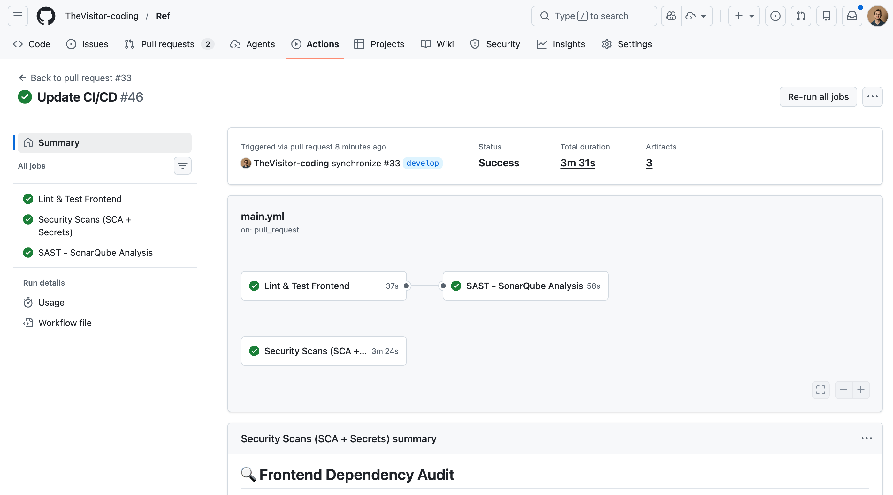
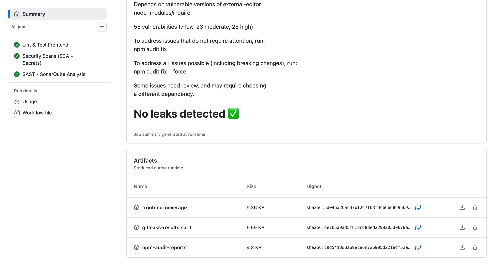
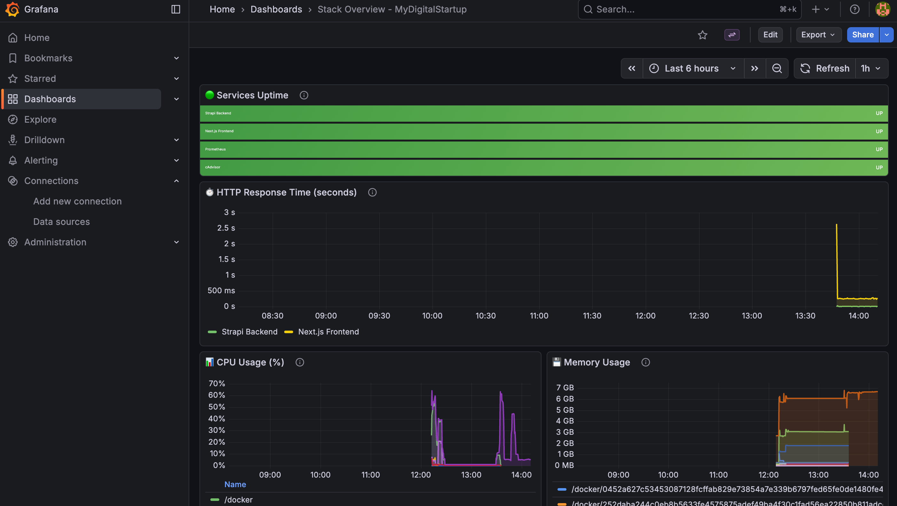
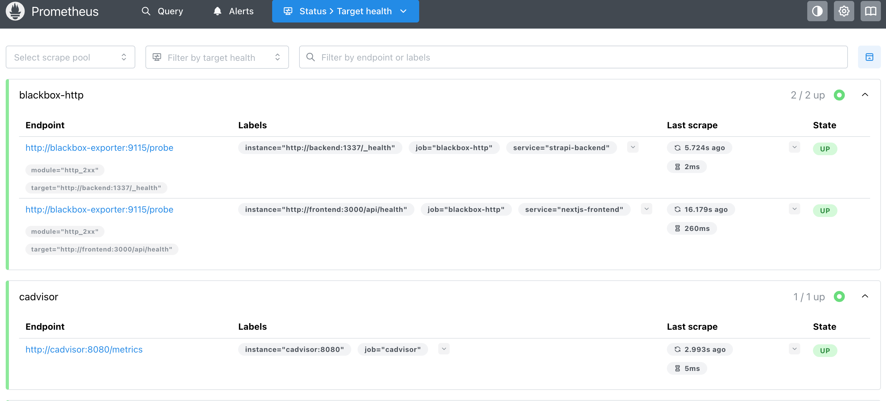

# Preuves et captures d'écran

Ce dossier contient les captures d'écran suivantes pour la validation de l'évaluation DevSecOps :

| Fichier | Description |
|---------|-------------|
| app-https.png | Capture de l'application accessible en HTTPS |
| workflow-pull-request.png | Capture du workflow GitHub Actions pour l'analyse de Pull Request |
| workflow-build-deploy.png | Capture du workflow GitHub Actions pour le Build & Deploy |
| artefacts.png | Capture des artéfacts générés par le pipeline CI/CD |
| monitoring-dashboard.png | Capture du dashboard de monitoring (Grafana) |
| prometheus-scraping.png | Capture de Prometheus montrant les services scrapés |

## Application Accessible en HTTPS

## Validation du Pipeline CI/CD
- **Pull Request Analysis** :

- **Build & Deploy** :

## Artéfacts CI/CD

## Monitoring Dashboard

- **Grafana Dashboard Self-Hosted** :

- **Prometheus** :

